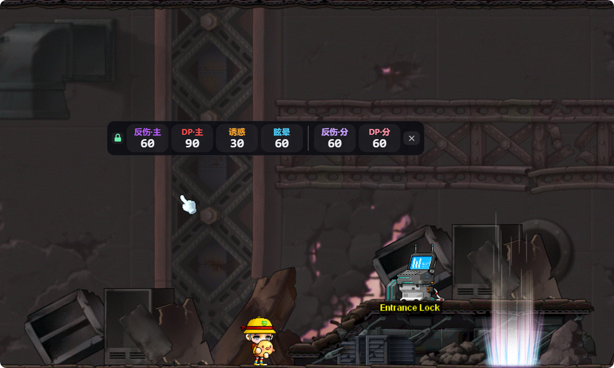
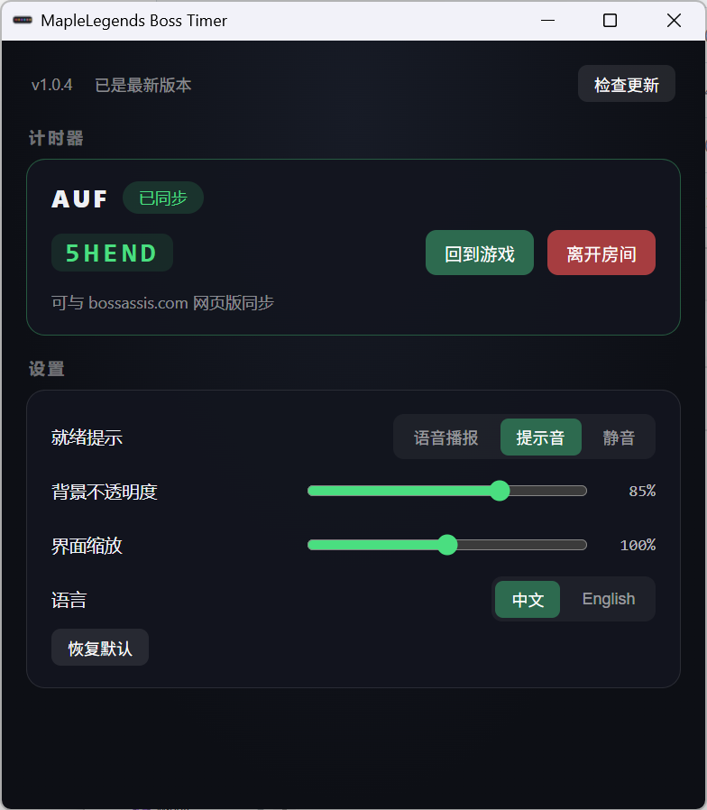

# MapleLegends Boss Timer

[](https://github.com/superjump22/mlboss-timer/releases/latest)
[](https://github.com/superjump22/mlboss-timer/releases/latest)
[](#license)

MapleLegends（冒险岛私服）副本 Boss 技能计时器客户端：悬浮窗计时面板 + bossassis 房间同步（队友可用官方网页版同房间互通）。

当前支持副本：AUF（更多副本开发中）。

## 界面预览

### 悬浮窗 · 游戏内计时



覆盖在游戏画面上方：主体/分身分组计时，倒计时警示红闪、就绪提示，锁定后点击穿透不挡操作，跟随游戏窗口移动并等比例缩放。

### 主客户端 · 管理中心



建房/加入房间、房间码复制、回到游戏；就绪提示（语音/提示音/静音）、透明度、缩放、语言等设置；版本更新检查。

## 功能

- 悬浮窗覆盖在游戏画面上方，点击穿透不挡操作，跟随游戏窗口移动/缩放
- 与 bossassis.com 网页版房间互通（队友零迁移）
- 就绪语音播报（中英双语）/ 提示音 / 静音三档
- 主体/分身技能分组计时，多开窗口跟踪切换
- 系统托盘常驻，界面透明度/缩放可调，中英文切换
- UI 热更新（EdgeOne Pages）+ 客户端更新检查（GitHub Releases）

## 下载

从 [Releases](https://github.com/superjump22/mlboss-timer/releases/latest) 下载最新版安装包。

> 下载时浏览器/系统可能提示"危险文件"：安装包未做代码签名（个人开发者证书成本高），属正常现象，选择"保留 / 仍要保留"即可。不放心可先上传 [VirusTotal](https://www.virustotal.com) 自行核验。

## 开发

```
cd shell
npm install
npm run dev        # 前端 :5173
cargo build --manifest-path src-tauri/Cargo.toml   # 壳 (需 Tauri 2 / Rust / WebView2)
```

## 构建

```
cd shell
npm run build
cargo tauri build --manifest-path src-tauri/Cargo.toml   # 产出 NSIS 安装包
```

## License

MIT
