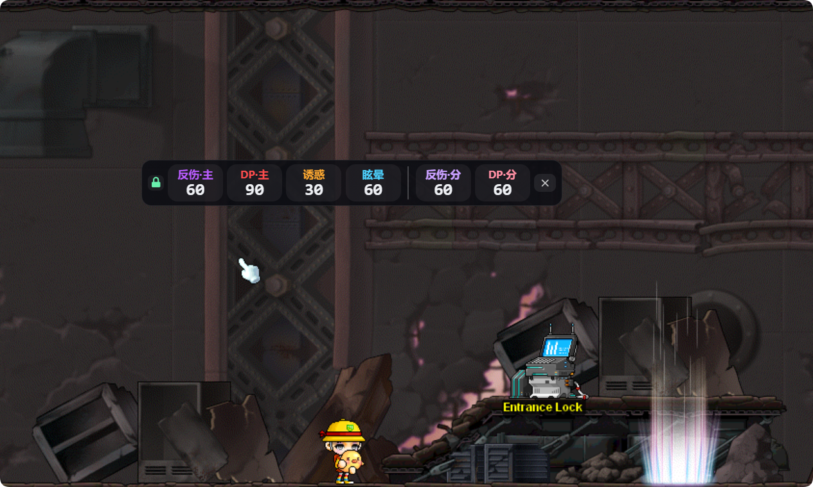
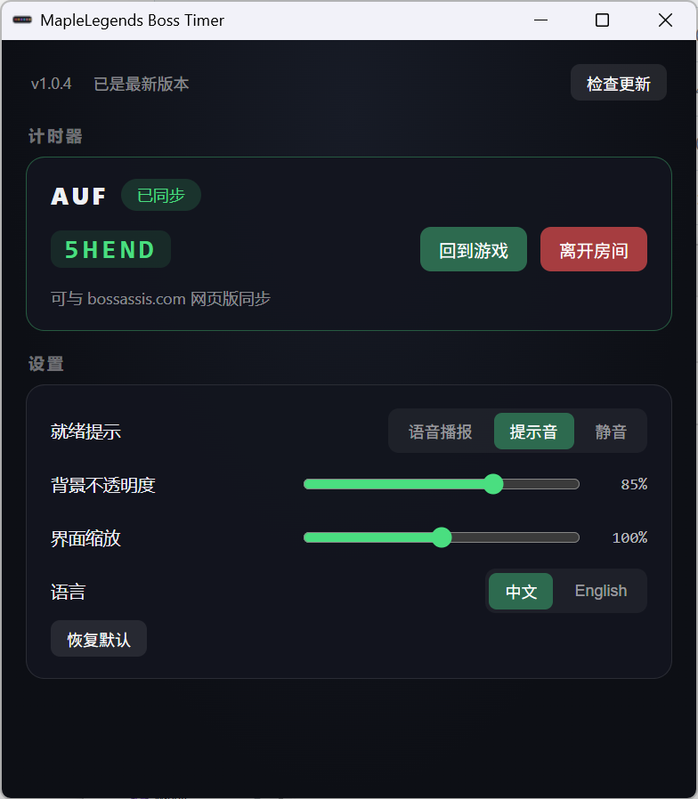

# MapleLegends Boss Timer

[](https://github.com/superjump22/mlboss-timer/releases/latest)
[](https://github.com/superjump22/mlboss-timer/releases/latest)
[](#license)

Boss skill timer client for MapleLegends: floating overlay panels with bossassis room sync — teammates can keep using the official web version in the same room.

Supported bosses: **PB (Pink Bean)** · **AUF (Aufheben)** · **HT (Horntail)**, each with its own overlay layout, theme color and settings.

## Screenshots

<table>
  <tr>
    <td></td>
    <td></td>
  </tr>
  <tr>
    <td align="center">Overlay · in-game timer</td>
    <td align="center">Main client · control center</td>
  </tr>
</table>

## Features

### Boss timers
- **PB (Pink Bean)** — 12 timers: DR / Zombify / Sed / Mini, five named R (Resurrection) slots and three named TL (Time Leap) slots
- **AUF (Aufheben)** — main body + clone: DR / DP / Sed / Stun
- **HT (Horntail)** — 12 timers grouped by part (left arm / right arm / middle head), color-coded by skill type (SED / MASS / DP)
- Each boss has its own overlay layout, theme color and fully independent settings

### In-game overlay
- Floating panel stays above the game; locked = full click-through (game input passes through the background)
- Follows the game window and scales proportionally with it; drag to reposition, position is remembered
- Tap a cell to start its cooldown, double-click to reset; anti-misclick guard while a timer is running
- Ready alerts: continuous blinking (default) or 3 blinks, plus an optional countdown bar that fills down as the cooldown progresses
- Ready sound: bilingual voice announcements (60 clips), beep, or mute
- Multi-client tracking: switch between game windows from the overlay; system tray support

### Room sync
- Create or join a room on the same bossassis server — fully interoperable with the official web version, so teammates don't need to install anything
- Room-wide timer offset (0-30s) for latency compensation, synced to everyone

### Per-boss settings
- Overlay position, lock state, UI scale (50%–400%), background opacity, sound mode, language (中文 / English), time format (m:ss or seconds), ready-blink style, countdown bar — all remembered per boss
- PB: name the R / TL slots locally, toggle support-skill display

### Client
- In-app updater: checks, downloads and installs new versions with one click, then relays what's new on first launch
- Version announcement: a short "What's New" card appears the first time you open a new version

## Download

Get the latest installer from [Releases](https://github.com/superjump22/mlboss-timer/releases/latest).

> Your browser may warn about a "dangerous file": the installer is unsigned (code signing certs are costly for indie devs). This is normal — choose "Keep". If in doubt, verify on [VirusTotal](https://www.virustotal.com) first.

## Development

```
cd shell
npm install
npm run dev        # frontend :5173
cargo build --manifest-path src-tauri/Cargo.toml   # shell (requires Tauri 2 / Rust / WebView2)
```

## Build

```
cd shell
npm run build
npx tauri build    # produces NSIS installer
```

## License

MIT
